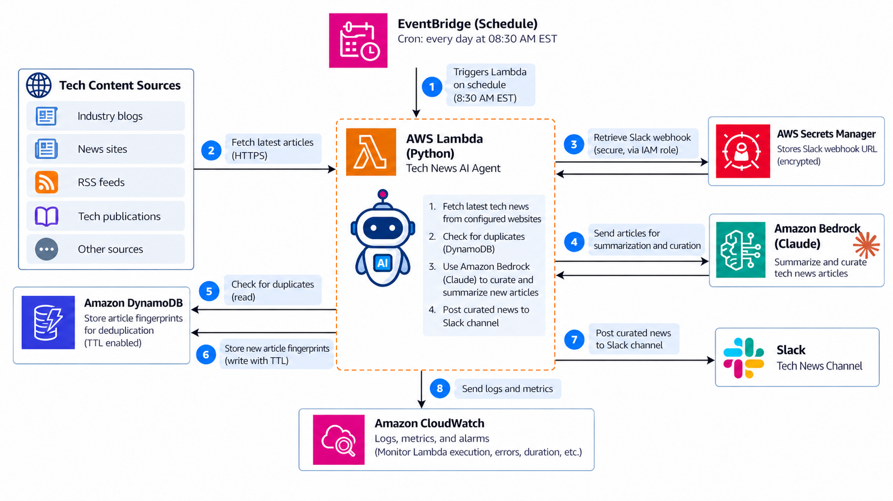

<div align="center">

# Terraform AWS Tech News AI Agent

### A reusable serverless Terraform template for curating and delivering AI-summarized technology news

[](https://www.terraform.io/)
[](https://aws.amazon.com/)
[](https://www.python.org/)
[](https://aws.amazon.com/bedrock/)
[](LICENSE)
[](#)

**EventBridge Scheduler → Lambda → DynamoDB → Amazon Bedrock → Slack**

A public-reference Terraform module for building a lightweight AI agent that gathers technology content, filters duplicate stories, uses a foundation model for curation and summarization, and delivers a daily digest to Slack.

</div>

---

## Why this exists

Keeping up with technology is increasingly an **information filtering problem** rather than an information access problem.

This module provides the infrastructure foundation for a small AI agent that can automate the repetitive part of that workflow: collect new content, eliminate stories it has already seen, summarize what matters, and deliver a concise digest to a channel you already use.

The module intentionally keeps content sources generic. It is designed as a reusable reference architecture rather than an integration tied to any particular publisher.

> **Reference template:** this repository provisions the AWS infrastructure. The article-fetching, parsing, prompting, summarization, and Slack formatting logic lives in your Lambda application package.

## Architecture

<p align="center">
  
</p>

### Request flow

1. **Amazon EventBridge Scheduler** triggers the workflow on a recurring schedule.
2. **AWS Lambda** runs the Python AI-agent workload.
3. The agent retrieves its Slack webhook from **AWS Secrets Manager**.
4. New content is checked against **Amazon DynamoDB** to prevent duplicate processing.
5. Relevant articles are sent to **Amazon Bedrock** for curation and summarization.
6. Newly processed article fingerprints are written back to DynamoDB with **TTL enabled**.
7. The curated digest is delivered to a **Slack channel**.
8. Execution logs, metrics, and alarms are handled through **Amazon CloudWatch**.

## What this module creates

| Component | Purpose |
|---|---|
| EventBridge Scheduler | Runs the agent on a configurable schedule and timezone |
| AWS Lambda | Hosts the Python AI-agent workload |
| DynamoDB | Stores article fingerprints for deduplication |
| DynamoDB TTL | Automatically expires stale dedupe records |
| Secrets Manager | Stores the Slack webhook securely |
| IAM roles and policies | Grants scoped service-to-service permissions |
| CloudWatch Logs | Captures Lambda execution logs |
| CloudWatch alarm | Monitors Lambda errors |
| Amazon Bedrock permissions | Allows invocation of explicitly configured models or inference profiles |

## Design goals

- **Reusable** — no publisher-specific configuration is baked into the module.
- **Serverless** — no always-on compute is required.
- **Low operational overhead** — managed AWS services handle scheduling, storage, secrets, and observability.
- **Least privilege by default** — permissions are scoped to the resources created or supplied to the module.
- **Safe for a public reference repo** — secret values are not committed or passed as normal Terraform variables.
- **Timezone aware** — EventBridge Scheduler uses an IANA timezone instead of forcing UTC conversions.
- **Extensible** — additional Lambda IAM statements and environment variables can be supplied when needed.

## Quick start

```hcl
provider "aws" {
  region = "us-east-2"
}

module "tech_news_agent" {
  source = "../../"

  name                = "tech-news"
  lambda_package_path = "${path.module}/lambda.zip"

  bedrock_model_id = "your-bedrock-model-or-inference-profile-id"
  bedrock_model_arns = [
    "arn:aws:bedrock:us-east-2:123456789012:inference-profile/example-profile"
  ]

  news_sources = [
    "https://example.com/technology/rss",
    "https://example.org/security/feed"
  ]

  schedule_expression = "cron(30 8 * * ? *)"
  schedule_timezone   = "America/Toronto"

  tags = {
    Environment = "demo"
    Project     = "tech-news-agent"
  }
}
```

Then initialize and validate the module:

```bash
terraform init
terraform fmt -recursive
terraform validate
terraform plan
```

## Slack webhook handling

By default, Terraform creates the **Secrets Manager secret metadata only**. The actual webhook value should be inserted separately so the plaintext webhook is not intentionally placed into Terraform configuration or state.

```bash
aws secretsmanager put-secret-value \
  --secret-id tech-news/slack-webhook \
  --secret-string '{"webhook_url":"https://hooks.slack.com/services/REPLACE_ME"}'
```

The Lambda application can then retrieve the secret at runtime and read the `webhook_url` property.

## Lambda environment variables

The module injects the following values into the function:

| Variable | Purpose |
|---|---|
| `DEDUPE_TABLE_NAME` | DynamoDB table containing article fingerprints |
| `DEDUPE_TTL_SECONDS` | Retention period for dedupe entries |
| `SLACK_SECRET_ARN` | Secrets Manager ARN containing the Slack webhook |
| `BEDROCK_MODEL_ID` | Bedrock model or inference-profile identifier |
| `NEWS_SOURCES_JSON` | JSON array of configured content sources |
| `LOG_LEVEL` | Application logging level |

Additional environment variables can be supplied using `lambda_environment_variables`.

## Deduplication model

A simple DynamoDB item can look like this:

```json
{
  "article_id": "sha256-of-canonical-url-or-content",
  "expires_at": 1791000000
}
```

`expires_at` must be a Unix epoch timestamp in seconds. DynamoDB TTL automatically removes stale fingerprints after they are no longer needed.

A canonical URL, normalized article identifier, or content hash can be used as `article_id` depending on the application logic.

## Scheduling

The default example runs every morning at 8:30:

```text
cron(30 8 * * ? *)
```

with:

```text
America/Toronto
```

Because EventBridge Scheduler supports IANA timezones, the schedule can remain aligned to local wall-clock time across daylight-saving changes.

## Security model

The module keeps permissions deliberately narrow:

- Lambda receives `secretsmanager:GetSecretValue` only for the configured Slack secret.
- DynamoDB permissions are scoped to the dedupe table.
- Bedrock invocation is scoped to model or inference-profile ARNs supplied by the caller.
- EventBridge Scheduler uses a dedicated role that can invoke only the module's Lambda function.
- DynamoDB server-side encryption is enabled.
- Optional customer-managed KMS keys can be supplied for Secrets Manager and CloudWatch Logs.
- The Slack webhook value is not required as a normal Terraform input.

The default Bedrock permissions are:

```text
bedrock:InvokeModel
bedrock:InvokeModelWithResponseStream
```

If the application later uses Guardrails, Knowledge Bases, Agents, or other Bedrock APIs, additional permissions can be added with `additional_lambda_policy_statements`.

## Application responsibilities

This Terraform module intentionally stops at infrastructure provisioning. Your Lambda package remains responsible for:

- fetching configured content sources;
- parsing feeds or web responses;
- normalizing article URLs or identifiers;
- calculating deduplication fingerprints;
- constructing prompts;
- calling Amazon Bedrock;
- formatting the final digest;
- posting the digest to Slack;
- handling application-level retries and filtering logic.

This separation keeps the infrastructure module reusable even if the agent implementation changes later.

## Repository layout

```text
terraform-aws-tech-news-agent/
├── main.tf
├── variables.tf
├── outputs.tf
├── versions.tf
├── README.md
├── LICENSE
├── .gitignore
├── docs/
│   └── architecture.png
└── examples/
    └── basic/
        └── main.tf
```

## Production hardening ideas

For a production deployment, you may want to extend the reference implementation with:

- an SQS dead-letter queue;
- structured JSON logging;
- CloudWatch dashboards;
- additional alarms and anomaly detection;
- explicit Lambda code-signing or artifact controls;
- VPC connectivity where private resources are required;
- Bedrock Guardrails;
- more advanced content reputation and filtering logic;
- CI checks such as `terraform fmt`, `terraform validate`, `tflint`, and security scanning.

## Requirements

| Dependency | Version / expectation |
|---|---|
| Terraform | `>= 1.6` |
| AWS provider | `>= 6.0` |
| Lambda artifact | ZIP package built separately |
| Amazon Bedrock | Model access configured in the deployment region |
| AWS credentials | Permissions to create the resources used by this module |

## License

Released under the [MIT License](LICENSE).

This makes the template easy to reuse, modify, fork, and build on while preserving the standard MIT copyright and warranty notice.

---

<div align="center">

**Built as a reusable reference architecture for experimenting with small, practical AI-agent workflows on AWS.**

</div>
